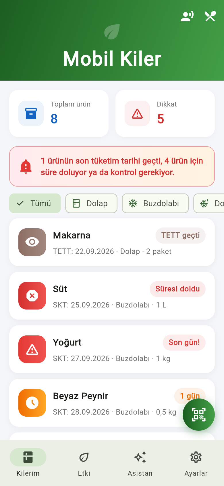
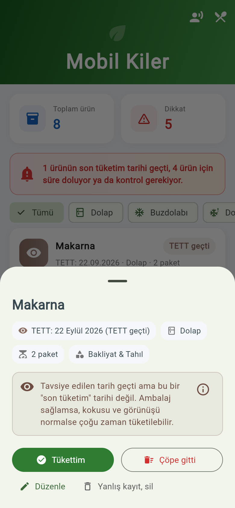
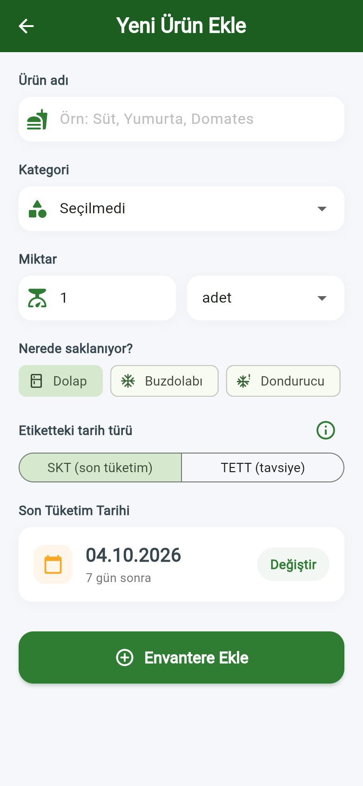
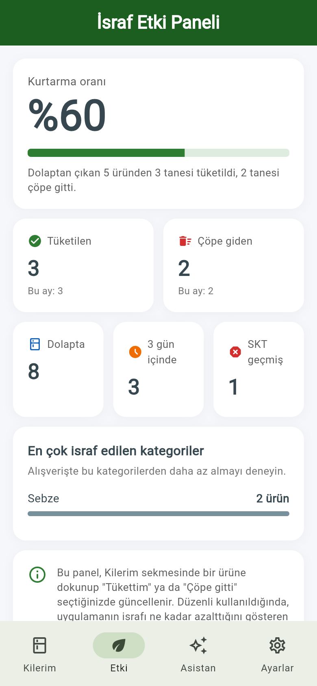
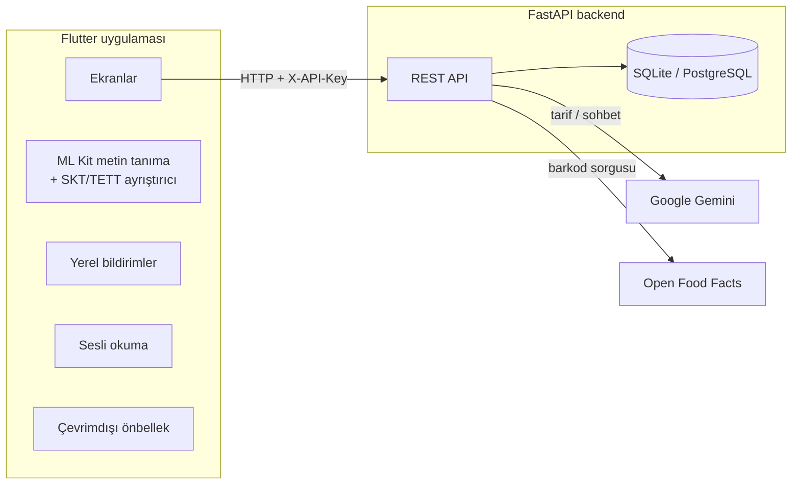

# Mobil Kiler

**Gıda israfını azaltan akıllı kiler asistanı** — Teknofest projesi.

Mobil Kiler, evdeki gıdaların son tüketim tarihlerini takip eder, tarihi yaklaşan ürünleri
hatırlatır ve dolaptaki malzemelerle (önce bozulacak olanları kullanan) tarifler önerir.
Kullanıcı bir ürünü "Tükettim" ya da "Çöpe gitti" diye işaretledikçe israf oranı ölçülür.

## Özellikler

| Özellik | Açıklama |
|---|---|
| Barkod / QR okuma | Ürün kameradan okutulur; barkod daha önce kayıtlıysa ya da Open Food Facts'te varsa ad ve kategori otomatik dolar |
| Etiketten SKT okuma | Etiketin fotoğrafı çekilir, tarih telefonun kendisinde (internetsiz, ML Kit) okunur. Türkçe etiketler için yazılmış ayrıştırıcı SKT, TETT ve üretim tarihini birbirinden ayırır |
| SKT – TETT ayrımı | SKT'si geçen ürün "tüketmeyin", TETT'i geçen ürün "kontrol edin, muhtemelen tüketilebilir" olarak gösterilir |
| Hatırlatmalar | SKT'ye 3 gün, 1 gün kala ve son gün yerel bildirim (sunucu gerekmez) |
| Yapay zekâ tarif | Gemini, SKT'si en yakın ürünleri önceleyerek tarif önerir; SKT'si geçmiş ürünler asla gönderilmez |
| Mutfak asistanı | Dolaptaki ürünleri bilen sohbet asistanı |
| İsraf etki paneli | Kurtarma oranı, tüketilen / çöpe giden ürünler, en çok israf edilen kategoriler |
| Erişilebilirlik | Dolabın sesli özeti ve etiketteki tarihi sesli okuma (görme engelli kullanıcılar için) |
| Çevrimdışı mod | Sunucuya ulaşılamazsa son görülen liste gösterilir |

## Ekran görüntüleri

| Kilerim | Ürün detayı | Ürün ekleme | İsraf etki paneli |
|---|---|---|---|
|  |  |  |  |

## Mimari



## Kurulum

### 1. Backend (sunucu)

Python 3.10 veya üstü gerekir.

```bash
cd backend
python -m venv venv
# Windows: venv\Scripts\activate    macOS/Linux: source venv/bin/activate
pip install -r requirements.txt
cp .env.example .env          # Windows: copy .env.example .env
# .env içine GEMINI_API_KEY değerini yazın (https://aistudio.google.com/apikey)
uvicorn main:app --host 0.0.0.0 --port 8000
```

`--host 0.0.0.0` telefonun aynı Wi-Fi'daki bilgisayara bağlanabilmesi için gereklidir.
API belgeleri: `http://localhost:8000/docs`

Testler:

```bash
pip install -r requirements-dev.txt
pytest
```

### 2. Mobil uygulama

Flutter 3.41 veya üstü gerekir.

```bash
cd mobil_uygulamam
flutter pub get
flutter run --dart-define=API_BASE_URL=http://<bilgisayarın-yerel-ip-adresi>:8000/api
```

Sunucu adresi uygulama içinden de değiştirilebilir: **Ayarlar → Sunucu adresi → Kaydet ve
bağlantıyı test et**.

- **iOS:** En az iOS 15.5 gerekir (ML Kit). `cd ios && pod install` ile bağımlılıklar kurulur.
  ML Kit, Apple Silicon Mac'lerdeki iOS simülatöründe çalışmayabilir; gerçek cihazda deneyin.
- **Android:** Etiket okuma ve bildirimler için gerçek cihaz önerilir.

Testler:

```bash
flutter analyze
flutter test
```

### 3. Sunucuyu buluta taşıma (isteğe bağlı)

`backend/Dockerfile` Docker destekleyen her platformda (Render, Railway, Fly.io vb.) çalışır.
Ortam değişkenlerine `GEMINI_API_KEY` ve `APP_API_KEY` eklenmeli, SQLite dosyası için `/data`
klasörüne kalıcı bir disk bağlanmalıdır (ya da `DATABASE_URL` ile PostgreSQL kullanılmalıdır).
Sunucu `https://` ile yayınlandığında uygulamada adres olarak o adres girilir.

## API

Tüm uç noktalar `/api` altındadır. `APP_API_KEY` tanımlıysa her istek `X-API-Key` başlığı gönderir.

| Yöntem | Yol | Açıklama |
|---|---|---|
| GET | `/health` | Bağlantı testi, yapay zekâ yapılandırılmış mı |
| GET | `/inventory/?status=active` | Ürünler (SKT'ye göre sıralı); `consumed`, `wasted`, `all` |
| POST | `/inventory/` | Ürün ekle |
| GET | `/inventory/expiring/?days=7` | Önümüzdeki N gün içinde süresi dolacaklar |
| PATCH / PUT | `/inventory/{id}` | Sadece gönderilen alanları güncelle |
| POST | `/inventory/{id}/close` | `{"outcome": "consumed"}` ya da `"wasted"` |
| DELETE | `/inventory/{id}` | Yanlış kaydı sil |
| GET | `/stats` | İsraf istatistikleri |
| GET | `/products/lookup?barcode=...` | Barkoddan ürün bilgisi |
| POST | `/suggest-recipe/` | Dolaptaki ürünlerle tarif |
| POST | `/chat/` | Mutfak asistanı |

## Proje yapısı

```
backend/                 FastAPI sunucusu
  main.py                uygulama, CORS, hata yönetimi
  routes.py              API uç noktaları
  models.py, schemas.py  veritabanı modelleri ve doğrulama
  database.py            bağlantı + eski veritabanına otomatik kolon ekleme
  security.py            API anahtarı ve yapay zekâ istek sınırı
  services/              Gemini ve Open Food Facts istemcileri
  tests/                 pytest testleri
mobil_uygulamam/         Flutter uygulaması
  lib/models/            veri modelleri
  lib/services/          API, ayarlar, bildirim, OCR, tarih ayrıştırıcı, sesli okuma
  lib/screens/           ekranlar
  test/                  birim ve arayüz testleri
```

## Demo günü kontrol listesi

- [ ] Sunucu bulutta ya da demo bilgisayarında çalışıyor; telefon ile aynı ağda
- [ ] Uygulamada **Ayarlar → Kaydet ve bağlantıyı test et** yeşil
- [ ] `GEMINI_API_KEY` kotası dolu değil (yedek anahtar hazır)
- [ ] Dolapta SKT'si geçmiş, bugün biten, TETT'i geçmiş ve taze ürünler var (tüm durumlar görünsün)
- [ ] Etki panelinde veri var (birkaç ürün "Tükettim" / "Çöpe gitti" işaretlenmiş)
- [ ] Etiketinde SKT yazan gerçek bir ürün hazır (etiketten okuma gösterimi için)
- [ ] İnternet giderse: çevrimdışı mod ve cihaz üstü etiket okuma çalışmaya devam eder

---

Bu depodaki `index.html`, `styles.css`, `script.js`, `js/` ve `CNAME` dosyaları kişisel
portfolyo sitesine aittir; açıklaması [PORTFOLIO.md](PORTFOLIO.md) dosyasındadır.
